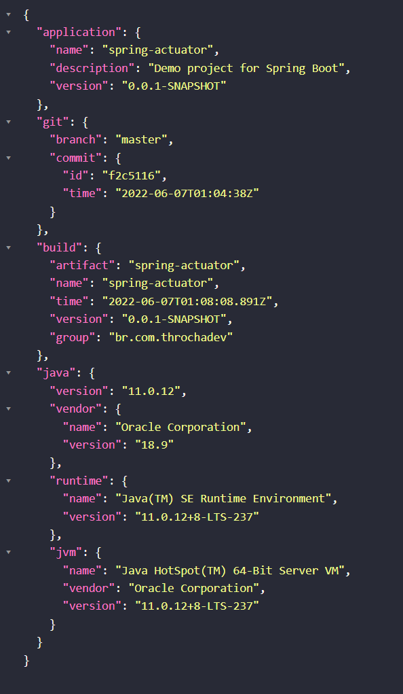

## Spring Actuator

O Spring Actuator nos permite monitorar e gerenciar a nossa aplicação.

### Configurando o Actuator

pom.xml

    <dependency>
        <groupId>org.springframework.boot</groupId>
        <artifactId>spring-boot-starter-actuator</artifactId>
    </dependency>

Plugin Git

    <plugin>
        <groupId>pl.project13.maven</groupId>
        <artifactId>git-commit-id-plugin</artifactId>
    </plugin>

Configuração para criar o arquivo build-info ao compilar o projeto:

    <executions>
        <execution>
            <goals>
                <goal>build-info</goal>
            </goals>
        </execution>
    </executions>

application.properties:

Coloquei algumas configurações personalizadas.

    # Configurando nome, descrição e versão da aplicação -> capturando do pom.xml
    info.application.name=@project.name@
    info.application.description=@project.description@
    info.application.version=@project.version@
    # Expondo meus endpoints do actuator -> os que eu quero
    management.endpoints.web.exposure.include=health,info,mappings
    # Habilitando qualquer propriedade env cujo nome começe com info
    management.info.env.enabled=true
    # Habilitando info build do projeto
    management.info.build.enabled=true
    # Habilitando info Java
    management.info.java.enabled=true

Executar o comando:

    mvn clean install

Ao acessar o endpoint do actuator voce terá a seguinte saida: 

    http://localhost:8080/actuator

Informa o status da aplicação:

    http://localhost:8080/actuator/health

Infomações da aplicação:

    http://localhost:8080/actuator/info

Fonte:

    https://docs.spring.io/spring-boot/docs/current/actuator-api/htmlsingle/#overview